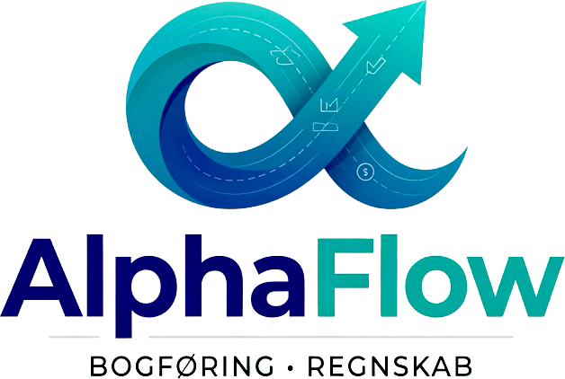

<p align="center">
  
</p>

<h1 align="center">AlphaFlow</h1>

<p align="center">
  <strong>Intelligent Accounting for Danish Small Businesses</strong><br/>
  Multi-tenant, AI-assisted bookkeeping — fully compliant with the Danish Bookkeeping Act (Bogføringsloven)
</p>

<p align="center">
  
  
  
  
  
  
  
  
  
  
  
  
</p>

---

## Why AlphaFlow?

Managing bookkeeping for a Danish small business means navigating VAT codes, SAF-T exports, e-invoicing via Peppol/NemHandel, digital VAT submission to Skattestyrelsen, and strict retention laws — all while just trying to run your company. AlphaFlow handles the complexity so you don't have to:

- **Full bookkeeping cycle** — from daily transaction entry to guided year-end closing and iXBRL annual accounts
- **Danish compliance built-in** — FSR chart of accounts, 10 VAT codes, SAF-T export, immutable audit trail with hash-chain verification, 5-year encrypted backups
- **Real e-invoicing via Sproom** — send & receive OIOUBL 2.1 (NemHandel) and Peppol BIS Billing 3.0 documents, with per-send status tracking, automatic retries and an e-faktura inbox
- **Real bank integration via Tink** — Open Banking account aggregation with OAuth2 consent, automatic syncs and encrypted-at-rest tokens
- **Digital VAT submission** — submit the momsangivelse directly to Skattestyrelsen's Moms-API (simulation fallback when unconfigured)
- **AI-assisted** — Hermes AI advisory chat (OpenRouter LLM + RAG knowledge base), 3-level bank reconciliation matching, VLM-powered document scanning
- **Multi-company** — run multiple entities with role-based team access from a single login
- **Subscription plans with usage quotas** — Frisbii (Flatpay) checkout, per-plan monthly quotas for e-invoices and Hermes messages, with add-on packages
- **Token-gated access** — proof-based access control as an alternative to plan subscriptions, 60-day free trial, no credit card required
- **Works everywhere** — installable PWA, offline support, Danish/English UI, dark/light themes

---

## Current Development Stage

The platform is feature-complete for its initial Danish SMV audience and is in **hardening/pre-launch** stage:

| Area | Status |
|---|---|
| Core bookkeeping (journal, ledger, accounts, periods, budgets, recurring) | ✅ Production-ready |
| E-invoicing via Sproom (Peppol + NemHandel) | ✅ Integrated — replaced the earlier Storecove Access Point; live against Sproom staging, production-ready via env switch |
| Received e-invoices (inbox) + outbound tracking/retry | ✅ Complete (webhooks + safety-net pollers) |
| Tink Open Banking | ✅ Real integration (was previously a stub) — sandbox & production modes |
| Skattestyrelsen Moms-API submission | ✅ Integrated with simulation fallback |
| CVR register lookup (VIRK) | ✅ Integrated with simulation fallback |
| Frisbii (Flatpay) subscription payments | ✅ Checkout + webhooks + billing scheduler (mock mode for dev) |
| Hermes AI assistant (Socket.IO + OpenRouter + RAG) | ✅ Running as dedicated mini-service with per-tenant quotas |
| Scanner service (Python OCR/VLM) | ✅ Extracted to standalone FastAPI service |
| Marketing site (/features, /pricing, /faq, /about, /contact, /terms) | ✅ Live with SEO, structured data, sitemap |
| Compliance package (Bilag 01–16) for Erhvervsstyrelsen review | ✅ Compiled in `docs/` |
| Self-service purchase of quota add-ons (Flatpay) | 🚧 Not yet — add-ons are activated by the App Owner via oversight (billed outside the app for now) |
| Legacy Storecove client/routes | ⚠️ Superseded by Sproom; `src/lib/storecove-client.ts` and `/api/storecove/*` remain as legacy but are no longer the active path |

---

## Quick Start

```bash
# 1. Clone
git clone https://github.com/Onezandzeroz/AlphaFlow-ZIPR-D.git
cd AlphaFlow-ZIPR-D

# 2. Install (auto-generates Prisma Client via postinstall)
bun install

# 3. Set up your database
cp .env.example .env
# Edit .env — set your PostgreSQL DATABASE_URL (e.g. Neon, Supabase, or local Postgres)
# Enable pgvector for the Hermes knowledge base:
#   psql "$DATABASE_URL" -f scripts/setup-pgvector.sql
bun run db:push
bun run audit-immutable   # AuditLog immutability triggers (Bogføringsloven §10-12)

# 4. Install the mini-services
cd mini-services/tokenpay-access-service && bun install && cd ../..
cd mini-services/notification-ws-service && bun install && cd ../..
cd mini-services/hermes-agent && bun install && cd ../..          # runs prisma generate via postinstall
cd mini-services/knowledge-service && bun install && cd ../..
cd mini-services/scanner-service && bash install.sh && cd ../..   # Python venv + Tesseract check

# 5. Optional seeds (Hermes skill catalog + RAG knowledge base)
bun scripts/seed-hermes-skills.ts
bun scripts/seed-knowledge.ts      # requires knowledge-service running

# 6. Start developing
bun run dev
```

Open **http://localhost:3000** and create your first account.

> The dev server uses Webpack mode (`--webpack`) which is required for Prisma compatibility with Next.js 16. The startup script handles port checks automatically.

> The mini-services start separately (one terminal each): `cd mini-services/<service> && bun run dev` (the scanner service uses `.venv/bin/python3 main.py`). See [STARTUP.md](./STARTUP.md) for full instructions covering all six services.

### First Steps After Login

1. **Set up your company** — Go to Settings → Company Profile. Add your CVR number (real lookup via the CVR register), bank details, and invoice settings.
2. **Seed the chart of accounts** — Go to Chart of Accounts → "Create standard Danish chart" (FSR-standard accounts adapted to your company type).
3. **Register for e-invoicing** — Settings → E-faktura: register the company with Sproom (NemHandel + Peppol) and start sending/receiving e-invoices.
4. **Add contacts** — Register your customers and suppliers under Contacts (with CVR auto-lookup).
5. **Start bookkeeping** — Create transactions, journal entries, or invoices — or scan receipts with the OCR/VLM scanner.

Or load **demo data** from the dashboard to explore all features with realistic sample data.

---

## Feature Overview

### Core Accounting

| | Feature | Details |
|---|---|---|
| 📒 | **Double-Entry Bookkeeping** | Full debit/credit posting with ±0.005 balance validation and voucher-number integrity checks |
| 🔗 | **Journal Hash Chain** | Cryptographic hash chaining of journal entries — tamper evidence for Bogføringsloven §10-12 |
| 📊 | **Chart of Accounts** | FSR-standard accounts (adapted per company type) + custom accounts, VAT mapping per account, posting-guide assistant |
| 🧾 | **Invoicing** | Line items, auto VAT, sequential numbering (`PREFIX-YEAR-SEQ`), PDF download, credit notes with automatic VAT adjustment and settlement |
| 💰 | **VAT Reporting** | 10 Danish VAT codes — S25/S12/S0/SEU (output) + K25/K12/K0/KEU/KUF (input); quarterly & yearly periods |
| 📤 | **Digital VAT Submission** | Submit the momsangivelse to Skattestyrelsen Moms-API (OAuth2) with full submission history — or simulation mode |
| 👥 | **Contacts** | Customers & suppliers with real CVR register lookup (VIRK), type classification, linked invoices & messages |
| 📈 | **Financial Reports** | Income statement (incl. waterfall), balance sheet, general ledger, aging reports, cash flow + forecast, account trends |
| 🏦 | **Bank Reconciliation** | 3-level matching engine — rule-based → fuzzy (Levenshtein) → LLM-assisted |
| 📋 | **Journal Entries** | Draft/Posted/Cancelled workflow with debit/credit balance validation and integrity verification |
| 🔄 | **Recurring Entries** | Daily/weekly/monthly/quarterly/yearly templates with automatic execution scheduler |
| 🎯 | **Budgets** | Monthly budgets per account with actual-vs-budget variance tracking |
| 📁 | **Projects** | Project accounting with per-project budgets, chart templates, and profitability reporting (feature-gated) |
| 🔒 | **Fiscal Periods** | Open/closed periods — locking prevents posting to closed months |
| 📅 | **Year-End Closing** | Guided closing that resets P&L accounts and locks all periods automatically |
| 📸 | **Receipt Scanning** | Dedicated Python scanner service — PyMuPDF PDF processing, Tesseract OCR (dan+eng), OpenRouter VLM extraction, Danish validators (CVR Mod-11, EAN-13, IBAN) |
| 💱 | **Multi-Currency** | DKK, EUR, USD, GBP, SEK, NOK with daily ECB exchange-rate updates |

### E-Invoicing (Sproom — Peppol + NemHandel)

| | Feature | Details |
|---|---|---|
| 📨 | **Sproom Access Point** | Single Access Point for BOTH networks — Peppol (BIS Billing 3.0) and NemHandel (OIOUBL 2.1). Replaces the former Storecove integration |
| 🏢 | **Multi-tenant child companies** | One Sproom child company per tenant (per CVR), auto-registered in NemHandel & Peppol, impersonation tokens cached automatically |
| 📄 | **Raw XML submission** | OIOUBL/Peppol XML sent as raw bytes — Sproom auto-detects the format; 11-category pre-validation before send |
| 📥 | **E-faktura inbox** | Received e-invoices land automatically via `DocumentReceived` webhook (RSA-signature verified) + 5-minute safety-net inbox poller; manual XML upload also supported |
| 📤 | **Send tracking** | Full lifecycle per sending (queued → sent → delivered/failed) via `DocumentStatusChanged` webhooks + 10-minute outbox poller |
| 🔁 | **Automatic retries** | Failed sends retry with exponential backoff (`nextRetryAt`), manual retry from the UI |
| 🔔 | **Real-time notifications** | Toast + notification center events on received documents and status changes (via the notification WebSocket service) |
| 📊 | **Usage quotas** | Monthly e-invoice quota per plan (send + receive combined) with add-on packages — see [Subscription Plans](#subscription-plans--usage-quotas) |

### Compliance & Exports

| | Feature | Details |
|---|---|---|
| 📤 | **SAF-T Export** | Danish Financial Schema XML with pre/post validation |
| 📊 | **Annual Report (iXBRL)** | Regnskab Special-ready inline XBRL using the Danish DCCA taxonomy + CSV export — for Erhvervsstyrelsen filing |
| 🔐 | **Audit Trail** | Immutable log (DB-level triggers prevent UPDATE/DELETE) with before/after values, IP & user-agent |
| 🛡️ | **Soft Delete** | Financial data is never physically deleted per Bogføringsloven |
| 💾 | **Backup System** | AES-256-GCM encrypted ZIP backups, per-tenant auto-scheduling at Danish local times, up to 60-month retention |
| 📦 | **Tenant Export/Import** | Upload & restore from ZIP — transactional with pre-restore safety backup |
| 🕵️ | **Security Log Monitor** | Daily 06:00 (Europe/Copenhagen) AuditLog security scan — email digest + immediate critical-incident alerts (e.g. delete attempts on posted entries) |
| 🦠 | **ClamAV Malware Scanning** | Uploaded files scanned via clamd INSTREAM before persistence |
| 📜 | **Consent Logging** | GDPR consent log per user (ConsentLog model) |

### Banking (Tink Open Banking)

| | Feature | Details |
|---|---|---|
| 🏦 | **Tink integration (real)** | Tink Link hosted OAuth2 UI → account listing → transaction fetch → token refresh → revoke. 3,000+ European banks. Sandbox & production via the same credentials flow |
| 🔐 | **SCA consent flow** | Full Strong Customer Authentication consent with consent logging |
| 🔒 | **Encrypted tokens** | Bank access/refresh tokens encrypted at rest (AES-256-GCM, `ENCRYPTION_KEY`) |
| 🔄 | **Auto Sync** | Scheduled transaction synchronization with detailed sync history |
| 🧪 | **Demo Bank** | Simulated bank for development/demos (free plan) |

### AI & Smart Features

| | Feature | Details |
|---|---|---|
| 🤖 | **Hermes AI assistant** | Danish-speaking accounting chat overlay — Socket.IO streaming, OpenRouter LLM (default `anthropic/claude-sonnet-4.5`), tenant-aware answers built on the tenant's own books |
| 📚 | **RAG knowledge base** | pgvector-backed semantic search (1,536-dim embeddings) over seeded + admin-managed knowledge documents; knowledge admin UI for SuperDev |
| 🧰 | **Hermes skills** | Seeded skill catalog with per-skill prompts (admin-managed) |
| 🚦 | **Per-tenant rate limits** | Rolling 30-day message quotas enforced by the hermes-agent service; live usage stats in the oversight UI |
| 🤖 | **AI Bank Reconciliation** | LLM-powered level-3 matching with confidence scoring |
| 🏷️ | **Smart Categorization** | AI account suggestions from the chart of accounts and document content |
| 👁️ | **VLM extraction** | Scanner service uses a vision LLM (OpenRouter) for receipts/invoices — amount, date, VAT rate, CVR — with Danish validators and a 754-LOC Danish regex parser |

### Multi-Tenant & Collaboration

| | Feature | Details |
|---|---|---|
| 🏢 | **Multi-Company** | Belong to multiple companies, switch instantly from sidebar |
| 🔑 | **RBAC** | 5 roles (Owner, Admin, Accountant, Viewer, Auditor) with fine-grained permissions |
| ✉️ | **Team Invitations** | Email-based with 7-day expiring tokens and acceptance tracking |
| 👁️ | **Oversight Mode** | SuperDev read-only cross-tenant access with tenant browser, trial management, quota add-on activation and Hermes usage stats |
| 🎭 | **Demo Company** | Shared read-only demo company with pre-seeded sample data |
| 🔐 | **2FA (TOTP)** | Time-based one-time passwords with QR provisioning, 10 single-use backup codes, secrets encrypted at rest; optional per-tenant enforcement |

### Subscription Plans & Usage Quotas

Five tiers (prices exclusive of Danish VAT), billed via **Frisbii (Flatpay)** hosted checkout with webhooks:

| Plan | Price | Binding | Seats | E-faktura/mo (send+receive) | Hermes msgs/mo |
|---|---|---|---|---|---|
| **Gratis** | 0 kr. (revenue < 50.000 kr./yr) | none | 1 (owner) | 10 + tilkøb | — (feature-gated) |
| **Månedlig** | 199 kr./mo | none | 3 | 30 + tilkøb | — (feature-gated) |
| **Pro** (annual) | 169 kr./mo | 12 mo | 5 | 50 + tilkøb | 200 + tilkøb |
| **Business** (2-year) | 149 kr./mo | 24 mo | 10 | 100 + tilkøb | 500 + tilkøb |
| **Business Extended** (3-year) | 145 kr./mo | 36 mo | 25 | 150 + tilkøb | 1,000 + tilkøb |

- **Feature gating per tier** — manual OIOUBL export (all tiers), auto e-invoice & real bank integration & advanced reports & data export (paid tiers), Hermes AI & projects (Pro+)
- **Add-on packages** — e-invoice quota (200/500/1000/2000 @ 1 kr./transaktion) and Hermes messages (250/500/1000/2000); activated by the App Owner via oversight until self-service purchase ships
- **Revenue check** — the free plan is gated on annual revenue staying under 50.000 kr.
- **Billing scheduler** — subscription-lifecycle reminder emails (FASE 6)
- **.tbkey proofs** — grant write access AND all features regardless of plan tier (alternative to plans)

### Access Control (TokenPay)

| | Feature | Details |
|---|---|---|
| 🔐 | **Proof-Based Access** | `.tbkey` encrypted proof files (AES-256-GCM, `PROOF_ENCRYPTION_KEY`) grant `read_write` access |
| 🆓 | **60-Day Free Trial** | Automatic trial granted on registration — no credit card needed |
| 🛡️ | **Owner Bypass** | AlphaAi owner (SuperDev) always has full access without proofs |
| 🚫 | **Write Guard** | `requireTokenPayAccess()` enforced on mutation API routes |
| 🔔 | **Upgrade Modal** | Shown automatically when write access is denied — guides to purchase |

### Marketing Site

Public, statically rendered pages with SEO metadata, JSON-LD structured data, `sitemap.xml` and `robots.txt`:

`/` (landing) · `/features` · `/pricing` · `/faq` · `/about` · `/contact` (form → email) · `/terms` · `/login`

### Dashboard & UX

| | Feature | Details |
|---|---|---|
| 📊 | **29 Dashboard Widgets** | KPIs, charts, forecasts, projects — reorderable, toggleable, per-company defaults (masonry layout, widget editor) |
| 🔔 | **Notification Center** | Real-time via WebSocket — notification read-state + cross-device data-changed invalidation |
| ⌨️ | **Command Palette** | `Cmd+K` / `Ctrl+K` quick navigation and actions |
| 🎹 | **Keyboard Shortcuts** | `Alt+N` (new), `Alt+I` (invoices), `Alt+R` (reports), `Alt+V` (VAT) |
| 💚 | **Financial Health Score** | 0–100 composite score analyzing trends, ratios, compliance |
| 🌙 | **Dark/Light Theme** | System-aware with manual override |
| 🇩🇰 | **Danish/English UI** | Translation keys, one-click switching |
| 📱 | **Responsive Design** | Desktop, tablet, and mobile with bottom nav, FAB, and swipe gestures |
| 📲 | **PWA** | Installable, offline caching via service worker |
| 📄 | **Terms of Service** | Built-in legal terms page |

---

## Architecture

```
┌────────────────────────────────────────────────────────────────────────┐
│                           Browser (PWA)                                 │
│                                                                          │
│  ┌──────────┐  ┌──────────┐  ┌───────────────────────────────────┐     │
│  │ Zustand   │  │  React   │  │  shadcn/ui (33 comps)             │     │
│  │  Stores   │  │  State   │  │  Recharts · Cmd Palette            │     │
│  │           │  │          │  │  Hermes overlay · Socket.IO client │     │
│  └────┬──────┘  └────┬─────┘  └───────────────────────────────────┘     │
│       │              │                                                   │
├───────┼──────────────┼───────────────────────────────────────────────────┤
│       │    REST API (179 route files) + marketing pages                  │
│  ┌────▼──────────────▼─────────────────────────────────────────────┐     │
│  │  Next.js 16 App Router (Webpack mode)                            │     │
│  │                                                                   │     │
│  │  ┌────────────┐ ┌─────────┐ ┌──────────┐ ┌───────────────────┐  │     │
│  │  │  Session   │ │  RBAC   │ │  Audit   │ │ Plan features +   │  │     │
│  │  │  Auth +2FA │ │ 5 roles │ │  Logger  │ │ usage quotas      │  │     │
│  │  └─────┬──────┘ └─────────┘ └──────────┘ └───────────────────┘  │     │
│  │  ┌────────────┐ ┌──────────────────────────────────────────┐    │     │
│  │  │ Background │ │ Integration clients:                      │    │     │
│  │  │ schedulers │ │ Sproom · Tink · Skat · Frisbii · CVR ·   │    │     │
│  │  │ (cron)     │ │ OpenRouter                                │    │     │
│  │  └────────────┘ └──────────────────────────────────────────┘    │     │
│  └────────┬────────────────────────────────────────────────────────┘     │
│           │                                                              │
│  ┌────────▼─────────────────┐   ┌─────────────────────────────────────┐  │
│  │  Prisma ORM → PostgreSQL │   │  Mini-services (Bun / Python)       │  │
│  │  45 models · 27 enums    │   │                                     │  │
│  │  Multi-tenant isolation  │   │  notification-ws   :3001 (Socket.IO)│  │
│  │  + pgvector knowledge    │   │  hermes-agent      :3004 (Socket.IO)│  │
│  └──────────────────────────┘   │  scanner-service   :3005 (FastAPI)  │  │
│                                 │  knowledge-service :3006 (HTTP)     │  │
│                                 │  tokenpay-access   :3100 (Hono)     │  │
│                                 └─────────────────────────────────────┘  │
└──────────────────────────────────────────────────────────────────────────┘
```

### Service Architecture

The application runs **six services** managed together via PM2 and routed through a single Caddy reverse proxy:

| Service | Port | Stack | Database | Purpose |
|---|---|---|---|---|
| **AlphaFlow** (host app) | 3000 | Next.js 16 + Prisma | PostgreSQL (Neon) + pgvector | Accounting app, marketing site, schedulers, integration clients |
| **notification-ws** | 3001 | Bun + Socket.IO | — (in-memory) | Real-time notifications + data-changed broadcasts |
| **hermes-agent** | 3004 | Bun + Socket.IO | PostgreSQL (shared, read) | Hermes AI chat agent — OpenRouter LLM, RAG retrieval, per-tenant rate limits |
| **scanner-service** | 3005 | Python + FastAPI | SQLite (own file) | OCR + VLM document scanning (dan+eng) |
| **knowledge-service** | 3006 | Bun + HTTP | PostgreSQL (shared, pgvector) | RAG document management + semantic search (internal — not routed via Caddy) |
| **tokenpay-access** | 3100 | Hono + Bun | SQLite (own file) | Token-gated proof-based access control |

> A seventh helper, **pg-service**, runs an embedded PostgreSQL 17 + pgvector for local sandbox development only — it is not part of production deployment.

> See [STARTUP.md](./STARTUP.md) for complete deployment instructions covering all services.

### Background Schedulers

Started automatically at server boot via `src/instrumentation.ts` (idempotent, individually disableable via env):

| Scheduler | Interval | Purpose |
|---|---|---|
| Backup scheduler | hourly/daily/weekly/monthly | Bogføringsloven §15 backups at Danish local times (`BACKUP_TIMEZONE`) |
| Recurring scheduler | frequent | Automatic execution of recurring entries |
| Billing scheduler | daily | Subscription-lifecycle reminder emails (FASE 6) |
| Log monitor | daily 06:00 | AuditLog security scan + alert emails |
| Sproom inbox puller | every 5 min | Safety-net for received e-invoices missed by webhooks |
| Sproom outbox poller | every 10 min | Safety-net status updates + auto-retry of failed sends |

### Key Design Decisions

- **Hybrid routing** — public marketing pages are server-rendered for SEO; the app itself is a single-route SPA (`/`) with 24 views managed by React state
- **Multi-tenant isolation** — Every query scoped to `companyId` via `tenantFilter()` in RBAC middleware
- **Session-based auth + 2FA** — HTTP-only cookie, 7-day sliding expiry, optional TOTP with encrypted secrets
- **Layered mutation guard** — Every write API enforces: auth → RBAC permission → oversight block → demo block → plan feature/TokenPay access
- **Access Point abstraction** — Sproom is the sole e-invoicing AP (Peppol + NemHandel); Storecove code remains only as a superseded legacy path
- **Simulation fallbacks** — Tink, Skat, CVR, Frisbii and Sproom all degrade to simulation/mock modes when unconfigured, so local dev works out of the box
- **Unified AI provider** — One OpenRouter API key powers Hermes chat, RAG embeddings fallback, and scanner VLM extraction
- **Webpack mode** — Next.js 16 runs with `--webpack` flag for Prisma compatibility (not Turbopack)
- **Immutable audit trail** — All mutations logged, DB triggers prevent UPDATE/DELETE (Bogføringsloven)
- **Soft-delete only** — Financial data is never physically deleted
- **Caddy gateway** — Single external port with `XTransformPort` query routing to internal services

---

## Tech Stack

| Layer | Technology | Purpose |
|---|---|---|
| **Runtime** | [Bun](https://bun.sh/) | JavaScript runtime, package manager, script runner |
| **Framework** | [Next.js 16](https://nextjs.org/) | React SSR/SSG with App Router (Webpack mode) |
| **UI** | [React 19](https://react.dev/) + [shadcn/ui](https://ui.shadcn.com/) | 33 Radix-based components, New York style |
| **Language** | [TypeScript 5](https://www.typescriptlang.org/) | Static type checking (host app + mini-services) |
| **Styling** | [Tailwind CSS 4](https://tailwindcss.com/) | Utility-first CSS with dark mode |
| **Database** | [PostgreSQL](https://www.postgresql.org/) via [Prisma 6](https://www.prisma.io/) | Relational database, type-safe ORM, pgvector for RAG |
| **State** | [Zustand 5](https://zustand.docs.pmnd.rs/) | Client state stores (auth, sidebar, language, scanner, widgets, plans, notifications, …) |
| **Forms** | [React Hook Form 7](https://react-hook-form.com/) + [Zod 4](https://zod.dev/) | Form handling & validation |
| **Charts** | [Recharts 2](https://recharts.org/) | Data visualization |
| **Realtime** | [Socket.IO 4](https://socket.io/) | Hermes chat streaming, notifications, data-changed events |
| **PDF** | [pdf-lib](https://pdf-lib.js.org/) + pdfjs-dist | Server-side invoice PDF generation + PDF-to-PNG |
| **OCR** | Tesseract (dan+eng) + PyMuPDF | Scanner service text extraction |
| **AI (LLM/VLM)** | [OpenRouter](https://openrouter.ai/) | Hermes chat, VLM extraction, embeddings (replaces z-ai-web-dev-sdk) |
| **E-invoicing** | [Sproom](https://sproom.net) | Peppol + NemHandel Access Point (replaces Storecove) |
| **Open Banking** | [Tink](https://tink.com) | Bank account aggregation (real integration) |
| **Payments** | [Frisbii](https://frisbii.com) (Flatpay checkout) | Subscription plan purchases |
| **XML** | [xmlbuilder2](https://github.com/oozcitak/xmlbuilder2) + fast-xml-parser | SAF-T, OIOUBL/Peppol, iXBRL generation & parsing |
| **2FA** | [otplib](https://otplib.yeetea.net/) + qrcode | TOTP with QR provisioning and backup codes |
| **Email** | [Nodemailer 8](https://nodemailer.com/) | SMTP with jsonTransport dev fallback |
| **Backup** | [Archiver](https://www.npmjs.com/package/archiver) + [JSZip](https://stuk.github.io/jszip/) | Encrypted ZIP backup creation and restore |
| **Scheduling** | [node-cron 4](https://www.npmjs.com/package/node-cron) | Backup, recurring, billing, log-monitor, Sproom schedulers |
| **Antivirus** | ClamAV (clamd INSTREAM) | Upload malware scanning |
| **Scanner service** | Python 3.11+ · FastAPI · uvicorn | Standalone OCR/VLM scanning service |
| **Access Service** | [Hono](https://hono.dev/) + [Bun](https://bun.sh/) | TokenPay proof-based access control micro-service |
| **Process** | [PM2](https://pm2.keymetrics.io/) + [Caddy](https://caddyserver.com/) | Production process management & HTTPS |

---

## Database

### Host App — PostgreSQL (Neon)

PostgreSQL with **45 models** and **27 enums**, fully multi-tenant:

```
Company (tenant boundary — plan tier, quotas, Sproom child-company, e-invoice settings)
 ├── UserCompany (role-based junction)
 ├── Invitation (7-day expiring tokens)
 ├── Account + StandardAccountMapping (chart of accounts, VAT mapping)
 ├── Transaction ── Payment (sales, purchases, salaries)
 ├── JournalEntry → JournalEntryLine (double-entry, hash chain)
 ├── Invoice (line items, PDF, OIOUBL) ── InvoiceCounter (sequential numbering)
 ├── ReceivedInvoice (e-faktura inbox — OIOUBL/Peppol inbound)
 ├── EInvoiceSending → EInvoiceSendEvent (outbound tracking + retry)
 ├── VATSubmission (Skattestyrelsen submission history)
 ├── Contact ── ContactMessage (customers, suppliers)
 ├── FiscalPeriod (open/closed months)
 ├── BankStatement → BankStatementLine (reconciliation)
 ├── BankConnection → BankConnectionSync (Tink Open Banking)
 ├── RecurringEntry (automated templates)
 ├── Budget → BudgetEntry (monthly planning)
 ├── Project → ProjectBudgetEntry (project accounting)
 ├── Document (journal entry attachments)
 ├── Backup (encrypted ZIP archives)
 ├── AuditLog + WebhookEvent (immutable log, webhook idempotency)
 ├── HermesAgent / HermesUsageRecord / HermesSkill / HermesAgentSkill
 ├── KnowledgeDocument → KnowledgeChunk (RAG, pgvector embeddings)
 ├── AgentReminder / AgentMessage (Hermes agent state)
 ├── NotificationRead (per-user notification read state)
 └── EmailLog + ConsentLog (delivery tracking, GDPR consent)

User (global identity — 2FA secrets, backup codes)
 ├── Session (with activeCompanyId + oversightCompanyId)
 └── Companies[] (via UserCompany junction)
```

### Mini-Service Databases (SQLite)

Two services keep their own self-initializing SQLite databases (`bun:sqlite` / Python `sqlite3`, no Prisma):

```
tokenpay-access-service/data/access.db
  users · proofs · access_log · messages

scanner-service/data/scanner.db
  scan results + audit trail (SHA-256 content cache)
```

### RBAC Permission Matrix

| Role | Level | Permissions |
|---|---|---|
| **Owner** | 5 | Full control + ownership transfer + member management + backups |
| **Admin** | 4 | Full control except ownership transfer |
| **Accountant** | 3 | Create/edit all accounting data, bank sync, period close |
| **Viewer** | 2 | Read-only access to all accounting data |
| **Auditor** | 1 | Read-only + report exports and audit runs |
| **SuperDev** | — | Read-only cross-tenant access (oversight mode); full Owner in own company |

---

## API

**179 route files** organized into logical groups. All mutating endpoints enforce the layered guard chain: authentication (incl. 2FA) → RBAC → oversight block → demo block → plan feature/TokenPay access.

| Group | Key Endpoints |
|---|---|
| **Auth & 2FA** | `login`, `register`, `me`, `logout`, `delete-account`, `promote-superdev`, email verification ×3, `forgot-password`, `reset-password`, `2fa/*` (setup, activate, disable, verify-login, backup-codes, status), `company/toggle-2fa` |
| **Companies & Team** | `companies` (CRUD), `company` (active), `company/switch`, invitations (send/accept/verify), members (role changes) |
| **Accounting** | `accounts` (CRUD + seed + trend + standard-mapping + posting-guide), `transactions` (CRUD + export + recent-descriptions), `journal-entries` (CRUD + verify-integrity + verify-numbering), `contacts` (CRUD + messages), `projects` (CRUD + budget + report) |
| **Invoicing & E-invoice** | `invoices` (CRUD + PDF + OIOUBL + validate + send + send-einvoice), `invoices/received/*` (inbox, unread, mark-read), `invoices/[id]/einvoice-sends/*` (list + retry), `einvoice-sends/*` (queue processing + debug-state), `contacts`, `exchange-rate` |
| **Sproom** | `sproom/peppol`, `sproom/register-nemhandel`, `sproom/create-child-company`, `sproom/register-webhook`, `sproom/webhook` (+ status), `sproom/participants`, `sproom/status`, `sproom/disconnect` |
| **Moms & Skat** | `vat-register`, `vat-report/submit`, `vat-report/submissions`, `vat-codes/mapping`, `export-momsliste` |
| **Reports & Analysis** | `reports`, `ledger`, `cash-flow`, `cash-flow-forecast`, `profit-loss`, `aging-reports`, `financial-health`, `budget-vs-actual`, `account-trend`, `expense-categories`, `year-end-closing`, `export-saft`, `export-tenant`, `import-tenant`, `annual-xbrl`, `annual-csv` |
| **Banking** | `bank-reconciliation`, `bank-connections` (CRUD + consent + sync + tink-callback + tink-accounts) |
| **Compliance** | `fiscal-periods`, `audit-logs` (+ alerts), `documents` (CRUD + serve), backups |
| **Planning** | `budgets`, `recurring-entries` (+ execute) |
| **Hermes** | `hermes/config`, `hermes/toggle`, `hermes/tenants`, `hermes/rate-limits`, `hermes/usage-stats`, `hermes/knowledge` (+ reindex), `hermes/skills` (+ prompts), `hermes/data-access` |
| **Oversight** | `oversight/tenants`, `oversight/switch`, `oversight/clear`, `oversight/trial`, `oversight/subscription`, `oversight/usage-addons`, `oversight/unverified-users`, `oversight/users/[userId]`, `oversight/notify-nemhandel`, `oversight/test-emails` |
| **Subscription** | `subscription/create-payment`, `subscription/payment-callback`, `subscription/payment-webhook`, `subscription/cancel` |
| **TokenPay Access** | `tokenpay/callback`, `proof-upload`, `proof-activate`, `access/[userId]` (+ status), `trial/start` |
| **Smart & System** | `ai-categorize`, `ocr/pdf`, `pdf-to-png`, `cvr/lookup`, `demo-mode`, `demo-seed`, `widget-settings`, `user/preferences`, `notifications/*`, `messages/[userId]`, `receipts/[...path]`, `csp-report` |

Rate limiting: 5/min for login/register, 1/min for verification emails, 1/5min for password resets.

---

## Danish Bookkeeping Law Compliance

AlphaFlow is built with full **Bogføringslov** compliance:

| Requirement | Implementation |
|---|---|
| **Audit Trail** (§10–12) | Immutable log (DB triggers) with timestamp, user, IP, user-agent, field-level changes + journal hash-chain verification |
| **Soft Delete** (§4–8) | Financial entries are cancelled, never physically deleted |
| **Fiscal Periods** | Periods can be locked to prevent posting to closed months |
| **Backup Retention** (§15) | Auto-scheduled encrypted ZIP backups with SHA-256, up to 60-month retention, Danish timezone scheduling |
| **Official Formats** | SAF-T export · OIOUBL 2.1 / Peppol BIS Billing 3.0 e-invoices (Sproom) · iXBRL annual accounts (Regnskab Special) · digital momsindberetelse (Skattestyrelsen) |
| **System Requirements** | Documented in the Erhvervsstyrelsen compliance package (see `docs/` Bilag 01–16) |

---

## Email System

Powered by [Nodemailer](https://nodemailer.com/) with bilingual (Danish/English) HTML templates:

| Flow | Trigger | Token Lifetime |
|---|---|---|
| Email Verification | Registration / re-send | Until used |
| Password Reset | "Forgot password" | 1 hour |
| Team Invitation | Owner/Admin invites | 7 days |
| Subscription Reminders | Billing scheduler (lifecycle events) | — |
| Security Digest / Alerts | Log monitor (daily 06:00 / critical events) | — |

**Dev mode** (default): When no SMTP is configured, emails are rendered and logged to console via `jsonTransport` — no emails are actually sent.

**Production**: Configure SMTP credentials in `.env` to send real emails.

---

## Backup System

Fully automated per-tenant backup system designed for **Bogføringsloven §15** compliance:

| Feature | Details |
|---|---|
| **Auto-Scheduled Backups** | 4 cron schedules — hourly, daily, weekly, monthly — per tenant at Danish local times (`BACKUP_TIMEZONE`) |
| **Encrypted at Rest** | ZIP archives encrypted with AES-256-GCM (`ENCRYPTION_KEY`) as `.zip.enc` on disk |
| **SHA-256 Checksums** | Every backup is checksummed; verified on restore to detect corruption |
| **Retention Policy** | 24 hourly / 30 daily / 52 weekly / 60 monthly / 999 manual — auto-cleaned daily |
| **Transactional Restore** | Delete + import runs inside a DB transaction — rolls back on failure |
| **Pre-Restore Safety** | Automatic safety backup created before any restore operation |
| **Upload & Restore** | Import a backup ZIP from another AlphaFlow instance |
| **Tenant Isolation** | Each backup contains only one tenant's data |

---

## Environment Variables

See [.env.example](./.env.example) for the complete annotated template. Summary:

| Variable | Required | Default | Description |
|---|---|---|---|
| `DATABASE_URL` | **Yes** | — | PostgreSQL connection string (Neon recommended) |
| `ENCRYPTION_KEY` | **Yes** (prod) | — | AES-256-GCM key (64-char hex) — bank tokens, backups, 2FA secrets |
| `PROOF_ENCRYPTION_KEY` | **Yes** | — | AES-256-GCM key for `.tbkey` proof decryption (TokenPay service won't start without it) |
| `OPENROUTER_API_KEY` | **Yes** (AI) | — | Unified AI provider key — Hermes chat + scanner VLM |
| `OPENROUTER_MODEL` | No | `anthropic/claude-sonnet-4.5` | Hermes chat model |
| `HERMES_ADMIN_KEY` | No | falls back to OpenRouter key | Shared secret for hermes-agent stats + knowledge-service |
| `HERMES_SERVICE_PORT` | No | `3004` | Hermes agent port |
| `KNOWLEDGE_SERVICE_PORT` | No | `3006` | Knowledge service port |
| `OPENAI_API_KEY` | No | — | Preferred (cheaper) embeddings provider for RAG |
| `SMTP_HOST/PORT/USER/PASS` | No | — | SMTP (dev console-logging fallback) |
| `EMAIL_FROM` / `APP_URL` | No | — | Sender address / public base URL for links |
| `ALERT_EMAIL_RECIPIENT` | No | — | Daily security digest + critical alert recipient |
| `TOKENPAY_API_KEY` | No | dev default | Must match `API_SHARED_KEY` in tokenpay service |
| `SCANNER_API_KEY` | No | dev default | Must match `API_SHARED_KEY` in scanner service |
| `SCANNER_PORT` | No | `3005` | Scanner service port |
| `TINK_CLIENT_ID/SECRET` | No | — | Tink Open Banking (sandbox or production) |
| `SKAT_CLIENT_ID/SECRET` | No | — | Skattestyrelsen Moms-API (simulation fallback) |
| `SPROOM_API_URL` | No | `https://staging.sproom.net` | Sproom Access Point base URL |
| `SPROOM_API_TOKEN` | No | — | Sproom parent-company API token (simulation fallback) |
| `SPROOM_WEBHOOK_REQUIRE_SIGNATURE` | No | `false` | `true` in production — fail-closed webhook signatures |
| `FLATPAY_API_KEY` | No | — | Frisbii checkout key (mock mode fallback) |
| `FLATPAY_WEBHOOK_SECRET` | No | — | Frisbii webhook signature verification |
| `CVR_API_USERNAME/PASSWORD` | No | — | VIRK CVR register credentials (simulation fallback) |
| `BACKUP_TIMEZONE` | No | `Europe/Copenhagen` | Backup cron timezone |
| `DISABLE_*_SCHEDULER` | No | — | Flags to disable individual background schedulers |

---

## Project Structure

```
AlphaFlow-ZIPR-D/
├── prisma/
│   └── schema.prisma              # 45 models, 27 enums (PostgreSQL + pgvector)
├── public/
│   ├── logo*.png, banner-*.png    # Brand assets
│   ├── icon-*.png                 # PWA icons
│   ├── manifest.json, sw.js       # PWA manifest + service worker
│   └── robots.txt                 # SEO
├── scripts/
│   ├── dev-server.ts              # Smart dev starter (port check + Webpack)
│   ├── apply-audit-immutability.ts# AuditLog DB triggers (§10-12)
│   ├── setup-pgvector.sql         # Enable pgvector on Neon (run once)
│   ├── seed-hermes-skills.ts      # Seed Hermes skill catalog
│   ├── seed-knowledge.ts          # Seed RAG knowledge base
│   ├── einvoice-send-worker.ts    # Process queued e-invoice sends
│   ├── migrate-bank-tokens.ts     # Encrypt pre-existing bank tokens
│   ├── kill-port.ts, ports        # Port utilities
│   └── ...                        # Test/report scripts (SAF-T, Peppol testbed)
├── docs/                          # Erhvervsstyrelsen compliance package (Bilag 01–16, Danish)
├── mini-services/
│   ├── tokenpay-access-service/   # Proof-based access control (Hono, port 3100)
│   ├── notification-ws-service/   # Real-time notifications (Socket.IO, port 3001)
│   ├── hermes-agent/              # Hermes AI agent (Socket.IO + OpenRouter, port 3004)
│   ├── scanner-service/           # OCR/VLM scanning (Python FastAPI, port 3005)
│   ├── knowledge-service/         # RAG semantic search (HTTP + pgvector, port 3006)
│   └── pg-service/                # Embedded PostgreSQL 17 + pgvector (sandbox only)
├── src/
│   ├── app/
│   │   ├── page.tsx               # Root SPA page (auth gate + 24-view router)
│   │   ├── login/                 # Login page (public route)
│   │   ├── features|pricing|faq|about|contact/ # Marketing pages (SEO)
│   │   ├── sitemap.ts, robots.ts  # SEO generators
│   │   ├── layout.tsx, error.tsx, globals.css
│   │   └── api/                   # 179 API route handlers
│   │       ├── auth/ (+2fa/)      # Auth + two-factor
│   │       ├── sproom/            # Sproom Access Point routes + webhooks
│   │       ├── storecove/         # Legacy Storecove routes (superseded)
│   │       ├── invoices/          # + received/ (inbox) + einvoice-sends (tracking/retry)
│   │       ├── vat-report/        # Moms submission to Skattestyrelsen
│   │       ├── bank-connections/  # Tink Open Banking
│   │       ├── subscription/      # Frisbii checkout + webhooks
│   │       ├── hermes/            # Agent config, knowledge, skills, usage
│   │       ├── oversight/         # SuperDev tenant/trial/quota management
│   │       └── ...                # accounts, transactions, journal, reports, etc.
│   ├── components/
│   │   ├── ui/                    # 33 shadcn/ui components
│   │   ├── marketing/             # Marketing shell, nav, footer, CTA, contact form
│   │   ├── hermes/                # Hermes overlay, panel, provider, socket hook
│   │   ├── invoices/              # Invoice page + e-invoice center, inbox, tracking, send dialogs
│   │   ├── dashboard/             # Dashboard, 29 widgets, plans prompt/widget
│   │   ├── layout/                # AppLayout, accordion nav, company selector, notifiers
│   │   ├── settings/              # Company, team, e-invoice, 2FA, oversight, hermes settings
│   │   ├── scanner/               # Receipt scanner (client engine)
│   │   └── ...                    # transactions, journal, reports, bank-recon, projects, ...
│   ├── lib/
│   │   ├── db.ts, session.ts, rbac.ts, route-guard.ts   # Core server stack
│   │   ├── sproom-client.ts       # Sproom AP client (Peppol + NemHandel)
│   │   ├── einvoice-sender.ts, einvoice-parser.ts, einvoice-response.ts
│   │   ├── sproom-inbox-scheduler.ts, sproom-outbox-scheduler.ts
│   │   ├── nemhandel-client.ts    # NHR/SMP lookup + simulation
│   │   ├── tink-client.ts         # Tink Open Banking client
│   │   ├── vat-submit.ts          # Skattestyrelsen Moms-API
│   │   ├── frisbii-checkout.ts, flatpay-client.ts, billing-scheduler.ts
│   │   ├── cvr-client.ts          # VIRK CVR register lookup
│   │   ├── plan-features.ts, plan-pricing.ts, usage-quotas.ts, plan-activation.ts
│   │   ├── openrouter.ts          # Unified AI provider
│   │   ├── crypto.ts, keyring.ts  # AES-256-GCM at-rest encryption
│   │   ├── two-factor.ts          # TOTP 2FA
│   │   ├── journal-hash-chain.ts  # Journal integrity
│   │   ├── log-monitor.ts (+ scheduler) # Security scanning + alerts
│   │   ├── clamav.ts              # Malware scanning
│   │   ├── annual-report-xbrl.ts / -csv.ts
│   │   ├── backup-engine.ts (+ scheduler), recurring-scheduler.ts
│   │   ├── storecove-client.ts    # LEGACY (superseded by Sproom)
│   │   └── ...                    # translations, matching-engine, ocr/, opencv/, marketing-data, seo
│   ├── instrumentation.ts         # Server boot — starts all background schedulers
│   └── fonts/                     # Geist Sans/Mono (woff2)
├── .env.example                   # Annotated environment template
├── ecosystem.config.example.js    # PM2 config for all 6 services
├── next.config.ts                 # Security headers, caching, PWA config
├── Caddyfile                      # Reverse proxy (HTTPS + XTransformPort routing)
├── components.json, tsconfig.json, eslint.config.mjs
└── package.json                   # Scripts and dependencies
```

---

## Scripts

| Command | Description |
|---|---|
| `bun run dev` | Start dev server (port check + Webpack mode) |
| `bun run dev:direct` | Start Next.js dev directly (no port check) |
| `bun run build` | Production build |
| `bun run start` | Start production server on port 3000 |
| `bun run start:pm2` | Start all services with PM2 (copy `ecosystem.config.example.js` → `ecosystem.config.js` first) |
| `bun run lint` | Run ESLint |
| `bun run db:push` | Push schema changes to PostgreSQL |
| `bun run db:generate` | Generate Prisma Client |
| `bun run audit-immutable` | Apply AuditLog immutability DB triggers (§10-12) |
| `bun scripts/seed-hermes-skills.ts` | Seed the Hermes skill catalog (idempotent) |
| `bun scripts/seed-knowledge.ts` | Seed the RAG knowledge base |
| `bun scripts/einvoice-send-worker.ts` | Process queued e-invoice sends manually |
| `bun run kill-port` / `bun run ports` | Port utilities |

---

## Deployment

### Production Stack

- **Runtime**: Bun (host app + 4 Bun mini-services) + Python 3.11 (scanner service)
- **Process Manager**: PM2 (6 instances, auto-restart, fork mode)
- **Reverse Proxy**: Caddy (automatic HTTPS via Let's Encrypt + `XTransformPort` routing)
- **Database**: PostgreSQL (Neon) with pgvector + 2 local SQLite files (TokenPay, Scanner)

> **Full deployment guide** — See [STARTUP.md](./STARTUP.md) for detailed step-by-step instructions covering all six services, provider credentials (Sproom, Tink, Skat, Frisbii, CVR, OpenRouter), troubleshooting, and update procedures.

---

## Security

- **Session-based auth + optional TOTP 2FA** — HTTP-only cookies, 7-day sliding expiry, bcrypt (12 rounds), encrypted TOTP secrets + backup codes
- **At-rest encryption** — AES-256-GCM (`ENCRYPTION_KEY`) for bank tokens, backup files, and 2FA secrets; keys never stored in the database
- **Layered mutation guard** — Auth → RBAC → Oversight block → Demo block → plan feature/TokenPay access
- **Rate limiting** — Login/register: 5/min, verification: 1/min, password reset: 1/5min
- **Webhook signature verification** — Sproom RSA (SHA256withRSA, fail-closed in production), Frisbii HMAC
- **Journal hash chain** — Cryptographic tamper evidence for posted entries
- **Security log monitoring** — Daily digest + immediate critical-incident emails
- **ClamAV malware scanning** — All uploads scanned via clamd before persistence
- **Security headers** — X-Frame-Options, X-Content-Type-Options, HSTS (via Caddy), CSP reporting endpoint
- **Tenant isolation** — All data scoped to `companyId` via RBAC `tenantFilter()` middleware
- **Path traversal protection** — Document serving validates file paths
- **Anti-enumeration** — Password reset always returns success regardless of email existence
- **Shared API keys** — Per-service shared secrets for inter-service authentication

---

## Documentation

| Document | Description |
|---|---|
| [README.md](./README.md) | This file — feature overview and quick start |
| [STARTUP.md](./STARTUP.md) | Complete deployment guide (local dev + production VPS, all services) |
| `docs/Bilag-01–16` | Erhvervsstyrelsen compliance package (Danish): anmeldelse, compliance report, krypteringsrapport, brugsvejledning, databehandleraftale, DPIA, beredskabsplan, leverandørstyring, udbedringsplan, TokenPay guide, NemHandel demo endpoints, Peppol testbed report |
| `docs/Implementeringsplan-Konkurrentanalyse-2026` | Competitor analysis implementation plan (Danish) |
| `mini-services/tokenpay-access-service/PROOF_FILE_SPECIFICATION.md` | `.tbkey` proof file format specification |
| `mini-services/scanner-service/README.md` | Scanner service detailed documentation |

---

## License

Private — All rights reserved.
